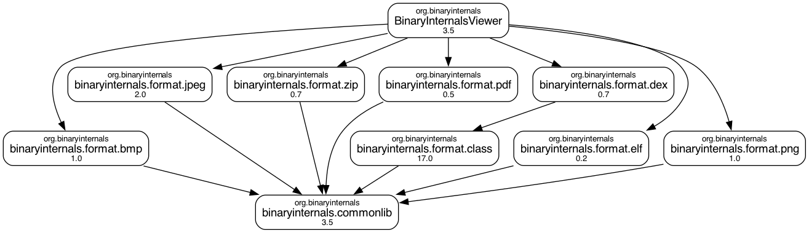

## `freeinternals` Binary Internals Viewer

An application to show binary file internals visually & interactively for the meaning of every byte.

Supported Formats

* [BMP](https://en.wikipedia.org/wiki/BMP_file_format) file
* [Class](https://docs.oracle.com/javase/specs/) file
  * Programming Logic: http://www.codeproject.com/Articles/35915/Java-Class-Viewer
  * Usage Sample: https://www.codeproject.com/Articles/762980/Inside-the-Hello-World-Application-via-Java-Class
* [JPEG](https://en.wikipedia.org/wiki/JPEG) file
* [PNG](https://en.wikipedia.org/wiki/Portable_Network_Graphics) file
* [ZIP](https://en.wikipedia.org/wiki/ZIP_(file_format)) file
  * [The structure of a PKZip file](https://users.cs.jmu.edu/buchhofp/forensics/formats/pkzip.html)
* Will supported formats
  * [DEX](https://en.wikipedia.org/wiki/Dalvik_(software)) file for Android (in progress)
  * [ELF](https://en.wikipedia.org/wiki/Executable_and_Linkable_Format) file for `*nix` systems (in progress)
 
Download

* Download Application: https://github.com/amosshi/freeinternals/releases

User guide

* We need the `java` command to run this tool
  * `java -jar BinaryInternalsViewer-3.5-timestamp.jar`
    * Where `timestamp` is the auto-generated build timestamp
  * Menu item: `File` > `Open...`
  * Choose the binary file to view

Build the Source Code

* Prerequisite
  * Java Version: `OpenJDK version 11` or higher
  * Set `JAVA_HOME` environment variable
    * If not set use the export statements in the `build.sh` script
  * Build Tool: `Apache Maven 3.5` or higher: because we are using the [Maven CI Friendly Versions](https://maven.apache.org/maven-ci-friendly.html) `${revision}` feature
* Build
  * `mvn  clean package install`
  * Build with Script
    * `./build.sh` (Linux/MacOS/Windows Git Bash)
    * `build.cmd` (Windows CMD)

Structure

* This application does not have 3rd party dependency other than JDK, easy to add it to your existing project
* Project Structure
  * `mvn dependency:tree`
  * `mvn com.github.ferstl:depgraph-maven-plugin:aggregate -DcreateImage -Dincludes=org.freeinternals -DshowGroupIds -DshowVersions -DoutputDirectory=docs` - this command needs `dot` command from [Graphviz](https://graphviz.org/)

Legacy note

* The original `Java Class Viewer` has been retired and merged into `Binary Internals Viewer` since Apr 2021
